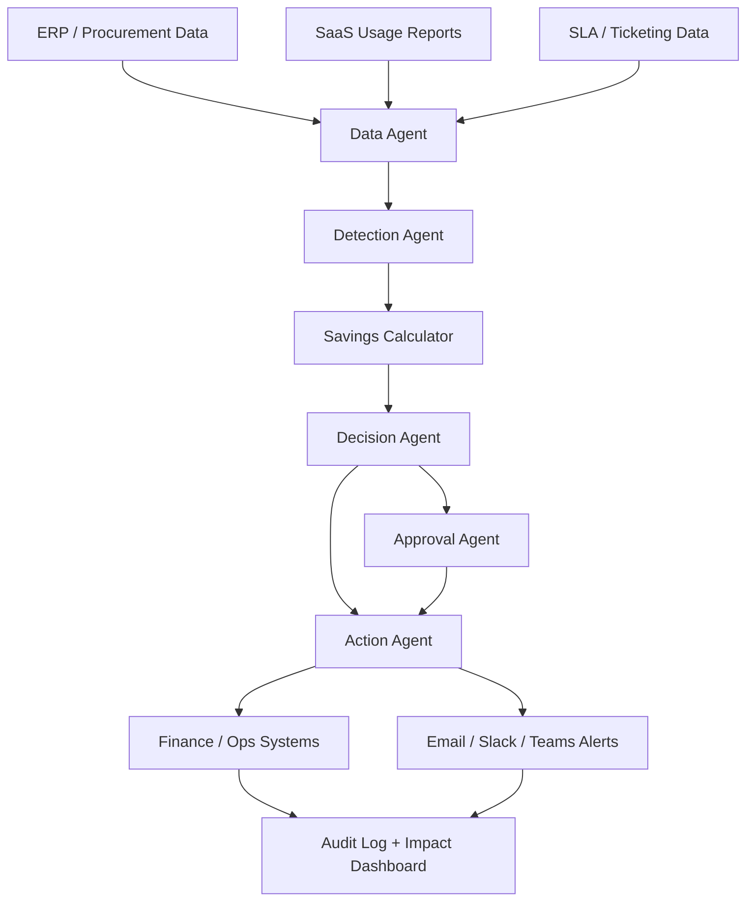

# Architecture Document and PPT Content

## Slide 1: Problem Statement
### Title
AI for Enterprise Cost Intelligence and Autonomous Action

### Problem
Enterprises lose money through hidden and repeated leakages such as duplicate invoices, overpriced vendor contracts, unused licenses, and SLA penalties.

### Current Gap
- detection happens late
- teams work in silos
- dashboards do not trigger action
- savings are hard to measure clearly

### Our Solution
CostPilot AI continuously monitors enterprise data, detects leakage, calculates impact, and starts corrective action through approval workflows.

---

## Slide 2: Solution Overview
### Solution Name
CostPilot AI

### One-Line Value Proposition
An AI-powered cost control manager that detects waste early and initiates the next best action with measurable financial impact.

### Core Capabilities
- duplicate invoice detection
- vendor rate optimization
- SaaS license utilization tracking
- SLA penalty prevention
- quantified savings estimation
- approval-based autonomous action

---

## Slide 3: System Architecture

### Agent Roles
- Data Agent: collects and standardizes enterprise data
- Detection Agent: finds anomalies and leakage patterns
- Savings Calculator: estimates financial impact
- Decision Agent: chooses recommended action
- Approval Agent: routes medium and high-risk actions for review
- Action Agent: triggers task, escalation, or system update
- Audit Layer: records every action and outcome

---

## Slide 4: Example Workflow
### Example 1: Duplicate Invoice
1. Procurement data is ingested
2. System finds 2 invoices with same vendor, amount, and month
3. Savings calculator estimates duplicate payment exposure
4. Approval task is sent to finance team
5. Payment is held until validated
6. Savings captured in dashboard

### Example 2: SLA Penalty Prevention
1. Operations data shows queue risk increasing
2. Risk score crosses threshold
3. System predicts likely SLA breach
4. Action agent escalates and reroutes work
5. Penalty is avoided
6. Avoided loss is recorded

---

## Slide 5: Data Inputs and Outputs
### Inputs
- invoice data
- vendor rates and contracts
- license usage reports
- SLA and ticket status

### Outputs
- cost leakage findings
- savings estimate
- approval tasks
- escalation alerts
- action logs
- management summary

---

## Slide 6: Governance and Risk Control
### Why This Matters
Enterprises need AI systems that act responsibly.

### Our Control Design
- low-risk actions can be automated
- medium-risk actions require manager approval
- high-risk actions require finance or operations approval
- every decision is logged with timestamp and reason
- all savings assumptions are visible and auditable

---

## Slide 7: Business Impact Model
### Sample Impact From Demo Data
- duplicate invoice blocked: INR 50,000
- SLA penalties avoided: INR 84,000
- unused licenses reduced: INR 41,400
- vendor rate optimization: INR 30,500

### Total Monthly Identified Impact
**INR 205,900**

### Annualized View
If similar leakage continues monthly:

**INR 24,70,800 per year**

---

## Slide 8: Why This Solution Can Win
- directly solves the problem statement
- shows quantifiable cost impact
- takes action, not just reporting
- works with enterprise approval workflows
- easy to pilot in one function and scale later

---

## Short Notes For Submission Document
If you need this as a 1-2 page architecture note, keep these sections:

1. Problem
2. Solution overview
3. Agent architecture
4. Data flow
5. Approval workflow
6. Impact model
7. Scalability and enterprise fit
