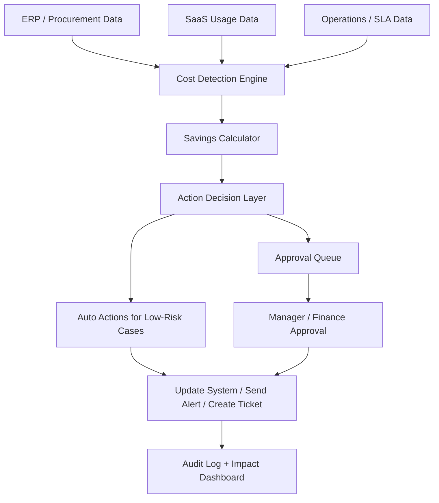

# Solution Overview

## Proposed Solution Name
CostPilot AI: Enterprise Cost Intelligence and Autonomous Action System

## Problem Fit
The hackathon asks for an AI system that does 3 things:

1. Continuously monitor enterprise operations data
2. Identify cost leakage or inefficiency patterns
3. Take corrective action with measurable financial impact

This solution directly fits that requirement.

## Simple Business Explanation
Think of this solution as an "AI cost control manager."

Instead of waiting for monthly reports, it checks spending and operations data every day. When it finds waste, such as duplicate invoices, expensive vendor rates, unused licenses, or upcoming SLA penalties, it recommends or triggers the next action automatically.

## Core Use Cases
- Duplicate invoice detection
- Vendor rate benchmarking
- Unused SaaS license cleanup
- SLA breach and penalty prevention

## How The System Works

## AI Agent Design
- Data Agent: Collects data from ERP, ticketing tools, SaaS admin panels, and vendor reports
- Detection Agent: Finds anomalies and waste patterns
- Decision Agent: Chooses the next best action
- Approval Agent: Sends tasks for review when risk is medium or high
- Action Agent: Creates ticket, email, escalation, or system update
- Audit Agent: Records what happened, who approved it, and money saved

## Example Business Impact
- Duplicate invoice blocked: INR 50,000 saved
- Vendor renegotiation: INR 24,000 monthly saved
- Unused licenses removed: INR 56,400 monthly saved
- SLA penalty prevented: INR 48,000 saved

## Why This Can Win
- Shows real business value
- Goes beyond dashboards
- Includes autonomous action
- Provides savings math
- Fits enterprise approval workflows
