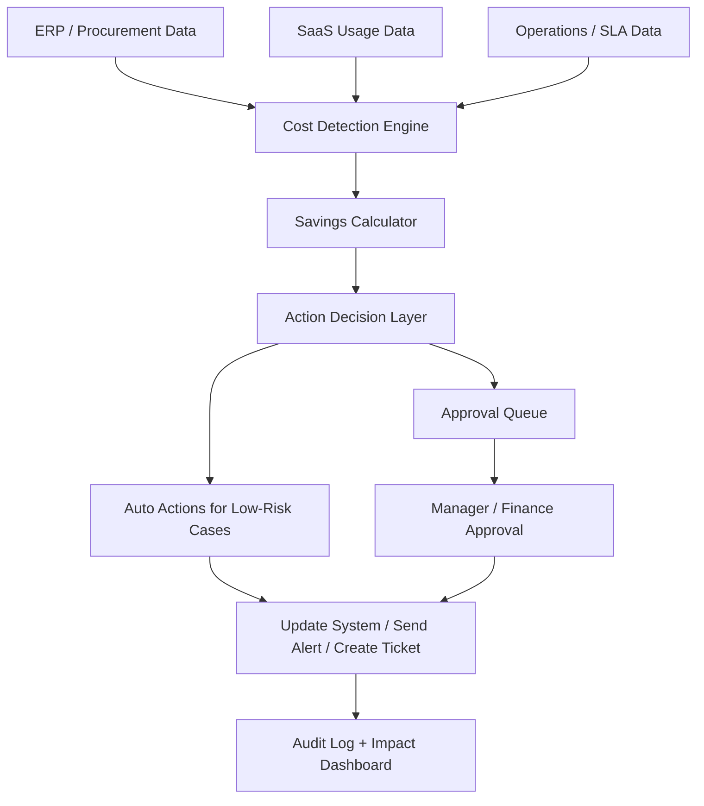

# Solution Overview

## Proposed Solution Name
CostPilot AI: Enterprise Cost Intelligence and Autonomous Action System

## Why This Problem Matters
I selected this problem because it reflects a very practical enterprise challenge.

In most organizations, cost leakage is not always visible in real time. Teams usually identify these issues after the reporting cycle, which means the business often reacts too late.

I wanted to design a solution that does more than report the problem. I wanted it to show how AI can help detect the issue early and also support the next business action.

My own background in insurance operations and business analysis made this problem especially relevant to me. In claims and operations environments, delays, manual intervention, reconciliation gaps, and missed SLAs can all create direct cost leakage and service issues.

## Problem Fit
The hackathon asks for an AI system that does 3 things:

1. Continuously monitor enterprise operations data
2. Identify cost leakage or inefficiency patterns
3. Take corrective action with measurable financial impact

This solution is built directly around those 3 expectations.

## Simple Business Explanation
I think of this solution as an AI-powered cost control manager.

Instead of waiting for a monthly review, the system checks spending and operations data continuously. When it finds waste, such as duplicate invoices, expensive vendor rates, unused licenses, or approaching SLA penalties, it raises the issue, estimates the impact, and recommends or triggers the next action.

## Core Use Cases
- Duplicate invoice detection
- Vendor rate benchmarking
- Unused SaaS license cleanup
- SLA breach and penalty prevention

## How The System Works

## AI Agent Design
- Data Agent: Collects data from ERP, ticketing tools, SaaS admin panels, and vendor reports
- Detection Agent: Finds anomalies and waste patterns
- Decision Agent: Chooses the next best action
- Approval Agent: Sends tasks for review when risk is medium or high
- Action Agent: Creates ticket, email, escalation, or system update
- Audit Agent: Records what happened, who approved it, and money saved

## Example Business Impact
- Duplicate invoice blocked: INR 50,000 saved
- Vendor renegotiation: INR 24,000 monthly saved
- Unused licenses removed: INR 56,400 monthly saved
- SLA penalty prevented: INR 48,000 saved

## My View As A Business Analyst
From a Business Analyst perspective, the strength of this solution is not only the AI layer.

The real value comes from:
- identifying the right leakage scenarios
- designing the workflow logic
- deciding when human approval is needed
- connecting every action to measurable business impact

That is what makes the idea realistic for enterprise adoption.

My experience in claims automation, stakeholder requirement gathering, reporting, and UAT shaped this thinking. I wanted the solution to feel usable in an actual enterprise setting rather than only sound technically impressive.
